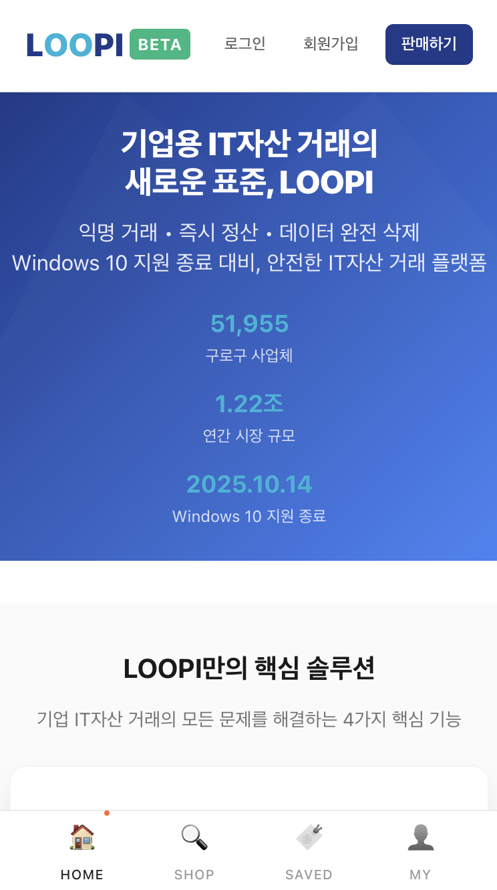
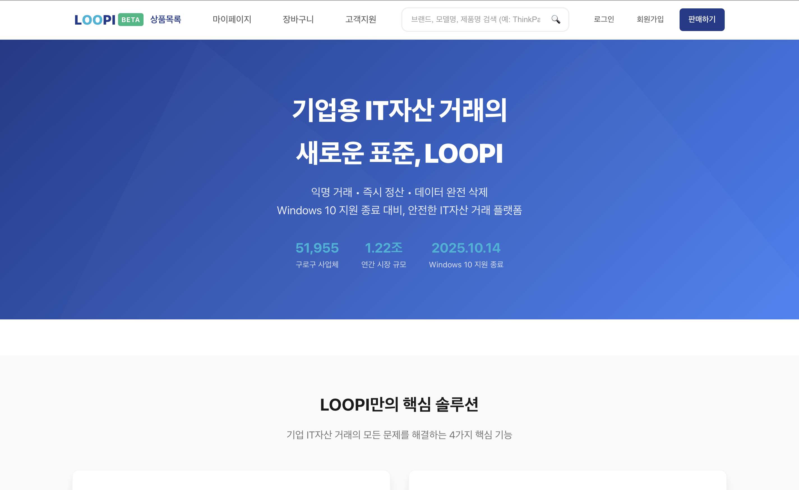

# 🔄 LOOPI -  KREAM 스타일 IT자산 전문거래 플랫폼

> 🌐 **Production**: https://loopi-frontend.vercel.app/

| 모바일 홈 화면 | 웹 홈 화면 |
| --- | --- |
|  |  |

[](https://www.typescriptlang.org/)
[](https://reactjs.org/)
[](https://nestjs.com/)
[](https://www.mysql.com/)

## 📖 프로젝트 개요

LOOPI는 KREAM을 벤치마킹한 현대적인 중고거래 플랫폼입니다. 실시간 거래, 입찰 시스템, 예약 매칭 등 혁신적인 기능을 통해 안전하고 편리한 거래 환경을 제공합니다.

### ✨ 주요 특징

- ⚙️ **실시간 거래 시스템**: 즉시 구매/판매 가능
- 📊 **가격 차트 및 분석**: 시장 동향 시각화
- 🔒 **안전거래 보장**: 에스크로 기반 결제 시스템
- 📱 **모바일 최적화**: 반응형 웹 디자인
- ⚡ **빠른 매칭**: 자동화된 거래 매칭 시스템

## 🏗️ 기술 스택

### Backend
- **Framework**: NestJS (Node.js)
- **Language**: TypeScript
- **Database**: MySQL 8.0+ with TypeORM
- **Authentication**: JWT Strategy
- **Architecture**: Modular Design Pattern

### Frontend
- **Framework**: React 18
- **Language**: TypeScript
- **Styling**: Styled-Components
- **State Management**: React Hooks
- **Routing**: React Router v6
- **UI/UX**: KREAM-inspired Design System

### DevOps & Deployment
- **CI/CD**: GitHub Actions
- **Frontend Deployment**: Vercel
- **Backend Deployment**: Railway
- **Database**: MySQL (Production)
- **Containerization**: Docker & Docker Compose
- **Development**: Hot Reload 지원
- **Build Tools**: Webpack, Vite

## 📁 프로젝트 구조

```
LOOPI/
├── 📂 backend/                    # NestJS API 서버
│   ├── 📂 src/
│   │   ├── 📂 modules/           # 기능별 모듈
│   │   │   ├── 📂 auth/          # 인증 시스템
│   │   │   ├── 📂 users/         # 사용자 관리
│   │   │   ├── 📂 products/      # 상품 관리
│   │   │   ├── 📂 orders/        # 주문 처리
│   │   │   ├── 📂 payments/      # 결제 시스템
│   │   │   ├── 📂 reservations/  # 예약 매칭
│   │   │   └── 📂 reviews/       # 리뷰 시스템
│   │   ├── 📂 database/          # DB 설정
│   │   ├── app.module.ts
│   │   └── main.ts
│   ├── docker-compose.yml
│   ├── Dockerfile
│   └── package.json
├── 📂 frontend/                   # React 클라이언트
│   ├── 📂 src/
│   │   ├── 📂 components/        # 재사용 컴포넌트
│   │   │   └── 📂 layout/        # 레이아웃 컴포넌트
│   │   ├── 📂 pages/             # 페이지 컴포넌트
│   │   │   ├── 📂 auth/          # 인증 페이지
│   │   │   └── 📂 admin/         # 관리자 페이지
│   │   ├── 📂 services/          # API 서비스
│   │   ├── 📂 hooks/             # 커스텀 훅
│   │   ├── 📂 styles/            # 글로벌 스타일
│   │   ├── 📂 types/             # TypeScript 타입
│   │   └── 📂 utils/             # 유틸리티 함수
│   └── package.json
├── 📂 docs/                      # 프로젝트 문서
├── .gitignore
└── README.md
```

## 🔑 핵심 기능

### 🛍️ 거래 시스템
- **즉시 구매/판매**: 시장가 기반 실시간 거래
- **입찰 시스템**: 원하는 가격으로 구매/판매 입찰
- **예약 매칭**: 자동화된 거래 조건 매칭
- **가격 차트**: 실시간 시세 및 거래 내역

### 👥 사용자 시스템
- **통합 계정**: 판매자/구매자 역할 자유 전환
- **프로필 관리**: 거래 내역 및 신뢰도 관리
- **비즈니스 인증**: 사업자 계정 별도 인증

### 💳 결제 시스템
- **안전거래**: 에스크로 기반 결제 보호
- **다양한 결제수단**: 카드, 계좌이체, 포인트
- **자동 정산**: 거래 완료 시 자동 정산

### 📊 데이터 분석
- **거래 통계**: 개인/전체 거래 분석
- **시장 동향**: 카테고리별 인기 상품
- **가격 예측**: 머신러닝 기반 시세 예측

## 🎨 UI/UX 특징

### KREAM 스타일 디자인
- **모던한 인터페이스**: 깔끔하고 직관적인 UI
- **모바일 최적화**: 반응형 웹 디자인
- **다크/라이트 테마**: 사용자 선호도 지원

### 주요 페이지
- **홈페이지**: 인기 상품 및 실시간 거래 현황
- **상품 상세**: 실시간 시세, 입찰 현황, 거래 내역
- **거래 페이지**: 구매/판매 프로세스
- **마이페이지**: 거래 내역, 입찰 현황, 관심 상품
- **관리자 페이지**: 상품 관리, 사용자 관리, 통계

## 🔐 보안 및 인증

- **JWT 기반 인증**: 안전한 토큰 기반 인증 시스템
- **입력값 검증**: 모든 API 엔드포인트에 유효성 검사
- **SQL 인젝션 방지**: TypeORM을 통한 안전한 DB 접근
- **CORS 설정**: 크로스 오리진 요청 보안 관리

## 📈 성능 최적화

- **코드 스플리팅**: React.lazy를 통한 번들 최적화
- **이미지 최적화**: WebP 포맷 지원 및 레이지 로딩
- **캐싱 전략**: API 응답 캐싱 및 정적 자원 캐싱
- **데이터베이스 최적화**: 인덱싱 및 쿼리 최적화

## 🙏 감사인사

- [KREAM](https://kream.co.kr/) - 디자인

---
